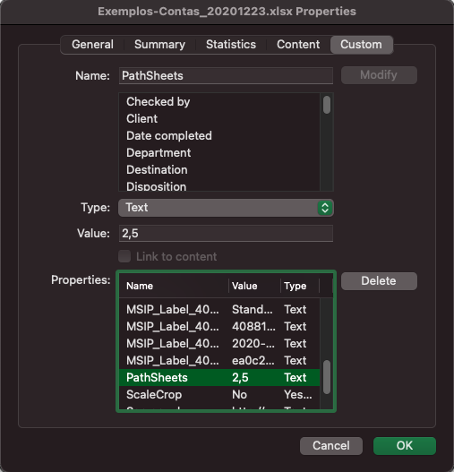
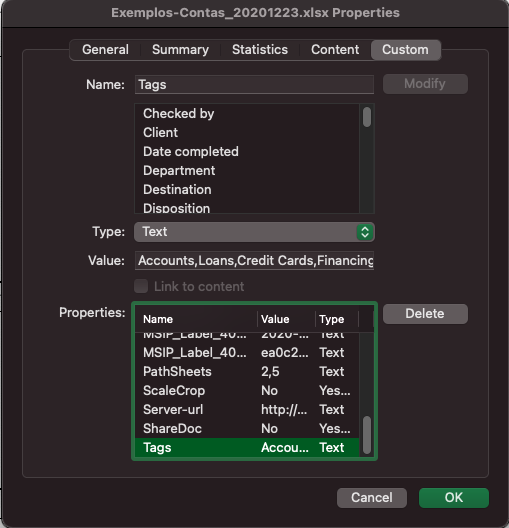
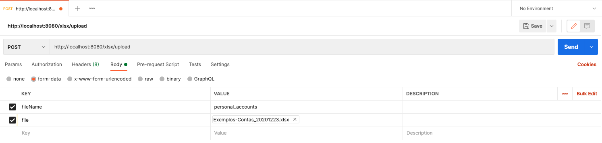
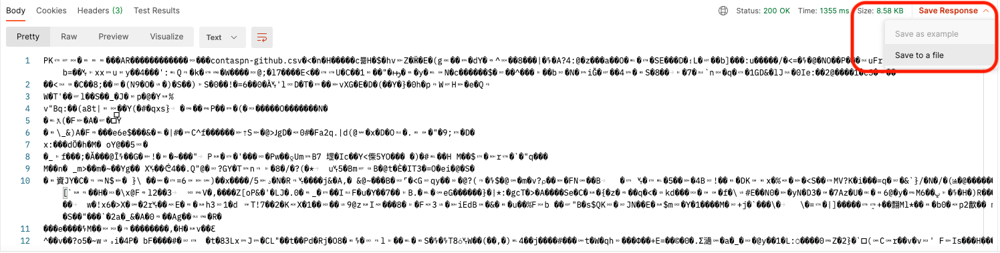

# OpenAPI CSV Generator
Gera arquivos csv baseados na planilha de definição.

O gerador está configurado para trabalhar com as planilha da fase1.

## Compilando a aplicação localmente

```
mvn clean package -DskipTests
```

## Executando a aplicação

```
mvn clean quarkus:dev
```

# Utilizando a planilha de testes.
Para definir meta informações a respeito das operações é possível fazer uso das properties nos arquivos xlsx.

No exemplo abaixo estamos utilizando a propriedade _PathSheets_ para listar quais abas devem ser processadas pelo importador. Utilizando o índice base 0 (zero).


_No exemplo acima importaremos as abas 2 e 5_


Se a propriedade não for localizada o utilitário irá exportar todas as abas como csv.

O uso de propriedades customizadas do excel pode ser bastante util para informar valores que não são passíveis de serem extraídos da leitura das colunas e celulas das abas.



### Acessando a aplicação com Postman



* Realize um POST para a URL _http://localhost:8080/xlsx/upload_.
* Como parâmetro utilize form-data
    * fileName = nome do arquivo
    * file = faça o upload pelo Postman (selecione File como tipo da propriedade _file_)
* Salve o arquivo de retorno. Se houver mais que uma aba para exportação o utilizário faz um zip com todas as abas extraidas onde cada aba será convertida em um csv.



## Empacotando a aplicação em Container

Existe um container funcional da aplicação [_marcelodsales/xlsxtocsv_](https://hub.docker.com/repository/docker/marcelodsales/xlsxtocsv)

Se desejar compilar uma versão da aplicação.

```
docker build -f src/main/docker/Dockerfile.jvm -t <SUA_TAG> .
```

## Executando a aplicação em Container

### Executando a versão do docker hub
```
docker run -i --rm -p 8080:8080 marcelodsales/xlsxtocsv
```

### Executando sua versão do container
```
docker run -i --rm -p 8080:8080 <SUA_TAG>
```

## Processando arquivos ao iniciar.
Quando o utilitário é executado ele busca por arquivo xlsx na pasta /deployments/convert. Caso encontre estes arquivos realiza a exportação automática.

### Criando uma pasta local para processamento.
Basta criar a mesma pasta esperada no utilitário (ou modificar o código fonte).
_obs: uma solução mais elegante seria configurar como variável podendo ser substituida por variável de ambiente_.
O caminho padrão é _/deployments/convert_. 

Todo e qualquer arquivo com extensão xlsx será processado e os arquios csv serão salvos na mesma página. 

O utilitário realiza esta ação apenas no momento de arranque, não é um pooling.

### Utilizando pré processamento com container
Se desejar processar os arquivos com a imagem de container basta seguir os passos:

1. crie uma pasta e conceda permissão para todos de escrita. O usuáro que o container utiliza é 1001
1. copie os arquivos xlsx que deseja para a pasta criada
1. inicie o container mapeando a pasta criada como volume. `docker run -i --rm -p 8080:8080 -v <CAMINHO_PASTA_XLSX>:/deployments/convert:z  marcelodsales/xlsxtocsv`